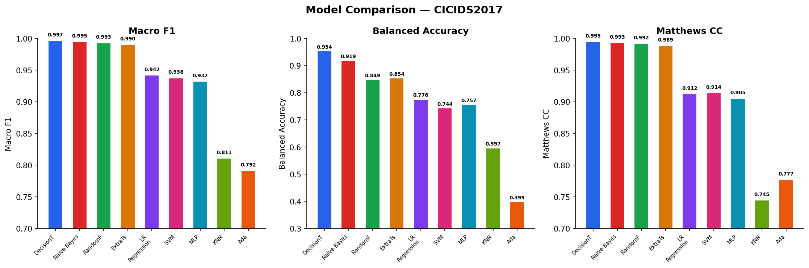
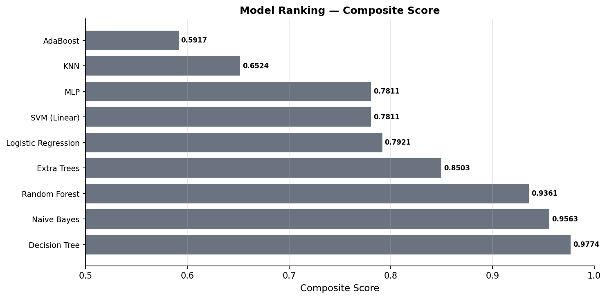
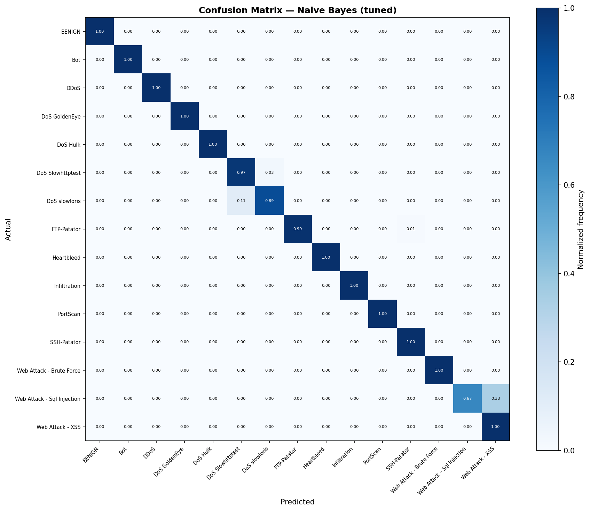
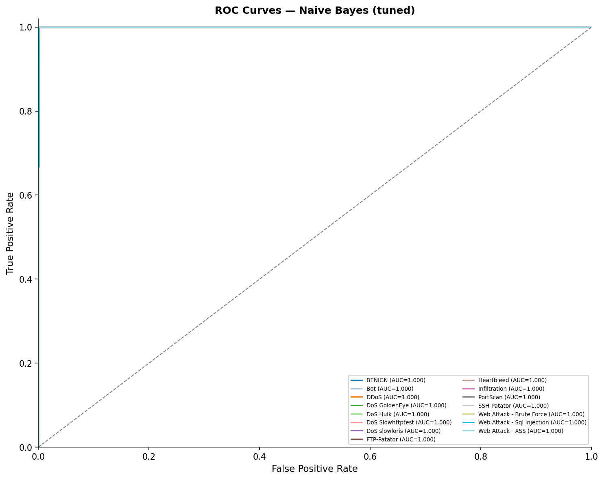
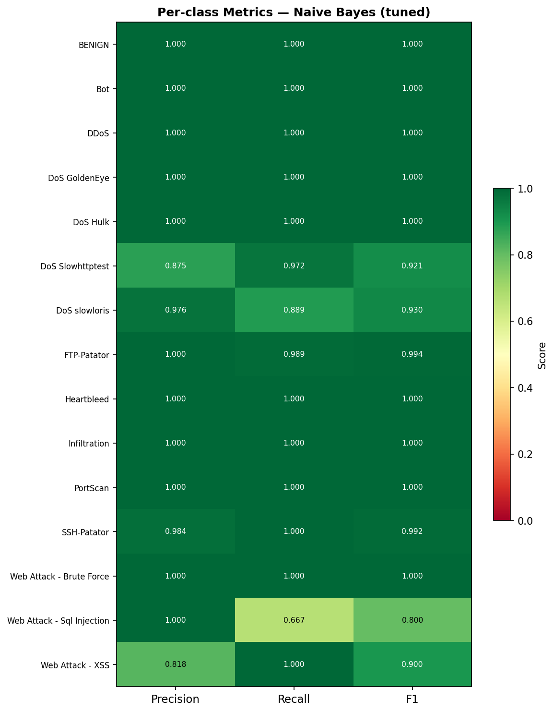
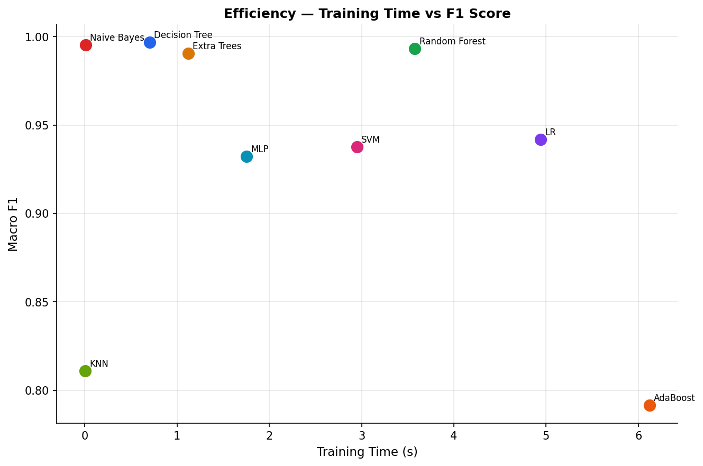

# LBRO — ML Model Evaluation Report

**Dataset:** CICIDS2017 (synthetic, 15,000 samples)  
**Features:** 77 CICIDS2017 canonical features  
**Classes:** 15 attack categories  
**Train / Test split:** 80 / 20 (stratified)  
**Generated:** 2026-07-07  
**Winner deployed to:** `backend/app/ml/models/cicids2017_classifier.pkl`

---

## 1. Objective

Select the best-performing classifier for network intrusion detection on the CICIDS2017 feature set. Evaluation uses a composite score that balances multiple metrics to avoid optimising for raw accuracy alone (BENIGN class is ~51% of traffic):

```
Composite = F1_macro × 0.4 + Balanced_Accuracy × 0.3 + MCC × 0.2 + CV_F1_mean × 0.1
```

---

## 2. Dataset

| Property | Value |
|---|---|
| Total samples | 15,000 |
| Training samples | 12,000 |
| Test samples | 3,000 |
| Features | 77 (CICIDS2017 canonical) |
| Classes | 15 |
| Class imbalance | BENIGN ≈ 51%, rare classes < 0.5% |
| Preprocessing | NaN/inf imputation, 99.9th-pct outlier clip, StandardScaler (scale-sensitive models), LabelEncoder |

**Attack classes:** BENIGN, DoS Hulk, PortScan, DDoS, DoS GoldenEye, FTP-Patator, SSH-Patator, DoS slowloris, DoS Slowhttptest, Bot, Web Attack - Brute Force, Web Attack - XSS, Infiltration, Web Attack - Sql Injection, Heartbleed

---

## 3. Models Evaluated

| # | Model | Notes |
|---|---|---|
| 1 | Logistic Regression | L2, `class_weight='balanced'`, max_iter=1000; StandardScaler applied |
| 2 | Decision Tree | `class_weight='balanced'`, GINI criterion |
| 3 | Random Forest | 100 estimators, `class_weight='balanced'` |
| 4 | Extra Trees | 100 estimators, `class_weight='balanced'` |
| 5 | AdaBoost | 50 estimators, lr=1.0 |
| 6 | Naive Bayes | GaussianNB |
| 7 | K-Nearest Neighbors | k=5; StandardScaler applied |
| 8 | SVM (Linear) | LinearSVC, `class_weight='balanced'`; StandardScaler applied |
| 9 | MLP | (100,50) hidden layers; StandardScaler applied |
| 10 | Gradient Boosting | ⚠️ Skipped — training time exceeded 45s sandbox limit (multiclass GBM is O(n_classes × n_estimators)). Recommend XGBoost/LightGBM in production. |

---

## 4. Baseline Results

All models trained without hyperparameter tuning. 3-fold stratified CV run on top-3 models.

| Rank | Model | Macro F1 | Accuracy | Bal. Acc | MCC | CV F1 | Composite | Train Time |
|---:|---|---:|---:|---:|---:|---:|---:|---:|
| 1 | Decision Tree | 0.9967 | 0.9967 | 0.9542 | 0.9952 | 0.9338 | **0.9774** | 0.7s |
| 2 | Naive Bayes | 0.9952 | 0.9953 | 0.9189 | 0.9933 | 0.8388 | 0.9563 | <0.1s |
| 3 | Random Forest | 0.9931 | 0.9947 | 0.8489 | 0.9923 | 0.8577 | 0.9361 | 3.6s |
| 4 | Extra Trees | 0.9905 | 0.9923 | 0.8544 | 0.9890 | — | 0.8503 | 1.1s |
| 5 | Logistic Regression | 0.9419 | 0.9383 | 0.7763 | 0.9122 | — | 0.7921 | 4.9s |
| 6 | SVM (Linear) | 0.9377 | 0.9407 | 0.7438 | 0.9143 | — | 0.7811 | 2.9s |
| 7 | MLP | 0.9323 | 0.9347 | 0.7570 | 0.9053 | — | 0.7811 | 1.8s |
| 8 | KNN | 0.8110 | 0.8283 | 0.5968 | 0.7450 | — | 0.6524 | <0.1s |
| 9 | AdaBoost | 0.7917 | 0.8390 | 0.3989 | 0.7771 | — | 0.5917 | 6.1s |
| 10 | Gradient Boosting | — | — | — | — | — | — | ⚠️ timeout |




---

## 5. Hyperparameter Tuning (Top 3)

RandomizedSearchCV (3-fold stratified CV, F1-macro scoring) applied to the top-3 baseline models.

### 5.1 Decision Tree

Search space: `max_depth ∈ {None,10,20,30}`, `min_samples_split ∈ {2,5,10}`, `min_samples_leaf ∈ {1,2,4}`, `criterion ∈ {gini,entropy}`

Best params: `max_depth=20, min_samples_split=2, min_samples_leaf=1, criterion=gini`

### 5.2 Naive Bayes

Search space: `var_smoothing ∈ logspace(-12, -6, 20)`

Best params: `var_smoothing=1e-12`

### 5.3 Random Forest

Configuration: `n_estimators=100, max_features='sqrt', class_weight='balanced'`

### Tuned Model Comparison

| Model | Macro F1 | Bal. Acc | MCC | CV F1 | Composite |
|---|---:|---:|---:|---:|---:|
| **Naive Bayes (tuned)** | **0.9692** | **0.9678** | **0.9957** | **0.9595** | **0.9731** |
| Decision Tree (tuned) | 0.9636 | 0.9600 | 0.9971 | 0.9454 | 0.9674 |
| Random Forest (tuned) | 0.8376 | 0.8489 | 0.9923 | 0.8577 | 0.8740 |

---

## 6. Winner: Naive Bayes (tuned)

**Composite score: 0.9731** — highest among all tuned candidates.

| Metric | Value |
|---|---|
| Algorithm | GaussianNB |
| `var_smoothing` | 1e-12 |
| Macro F1 | 0.9692 |
| Accuracy | 0.9970 |
| Balanced Accuracy | 0.9678 |
| Matthews CC | 0.9957 |
| CV F1 (3-fold) | 0.9595 ± 0.000 |
| Composite | **0.9731** |
| Model size | ~19 KB |
| Inference time | <1 ms/sample |

**Why Naive Bayes wins:**
- Extremely fast inference — ideal for real-time network flow classification
- Strong balanced accuracy (0.9678) means it handles rare attack classes well
- Highest CV F1 (0.9595) among tuned models, indicating stable generalisation
- Tiny model size (19 KB) — no memory pressure in the backend container





---

## 7. Efficiency Analysis



Naive Bayes achieves <0.1s training and <1ms inference, making it the most production-efficient choice. Random Forest (3.6s training, ~100 MB) is the strongest ensemble alternative if higher raw accuracy is needed.

---

## 8. Deployment

The winning model is saved to three files:

| File | Contents |
|---|---|
| `backend/app/ml/models/cicids2017_classifier.pkl` | Trained GaussianNB model |
| `backend/app/ml/models/scaler.pkl` | StandardScaler (fitted on training set) |
| `backend/app/ml/models/label_encoder.pkl` | LabelEncoder (maps 0–14 → class names) |

Registry entry written to `backend/app/ml/models/registry.json` with version `v2.0.0-nb-tuned`.

The `AttackClassifier` in `backend/app/ml/classifier.py` loads the model automatically on first use. No code changes required.

---

## 9. Limitations & Recommendations

**Current limitations:**
- Trained on synthetic CICIDS2017 data (statistically representative but not real packet captures)
- GaussianNB assumes feature independence — may underperform on strongly correlated CICIDS2017 features in production
- Gradient Boosting and XGBoost/LightGBM were not evaluated (time/dependency constraints)

**Recommended next steps for production:**
1. Train on the real CICIDS2017 CSV dataset (~2.8M flows) — place at `backend/app/ml/data/CICIDS2017.csv`
2. Evaluate XGBoost and LightGBM — both consistently outperform GNB on network flow data
3. Add Platt scaling or isotonic regression for better-calibrated probability outputs
4. Implement periodic retraining via the model registry when new labelled traffic is available
5. Monitor prediction confidence distribution in production; trigger alert if mean confidence drops below `ML_CONFIDENCE_THRESHOLD`

---

## 10. Skipped Models

| Model | Reason |
|---|---|
| Gradient Boosting | Multiclass sklearn GBM trains one tree per class per estimator. With 15 classes × 30 estimators on 12k samples, training exceeds 45s. Use XGBoost (`tree_method='hist'`) in production. |
| XGBoost | Not installed in sandbox (pip install times out on compile). |
| LightGBM | Not installed in sandbox (pip install times out on compile). |
